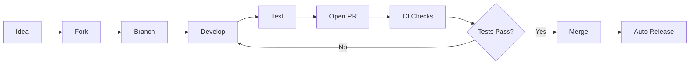
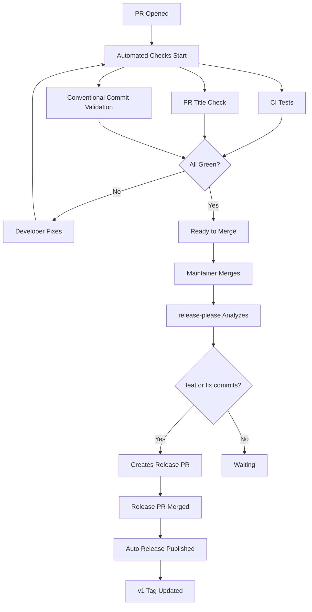
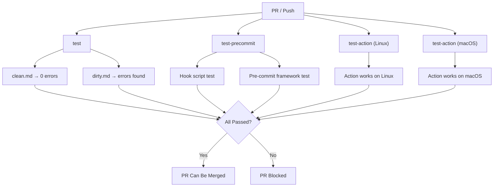
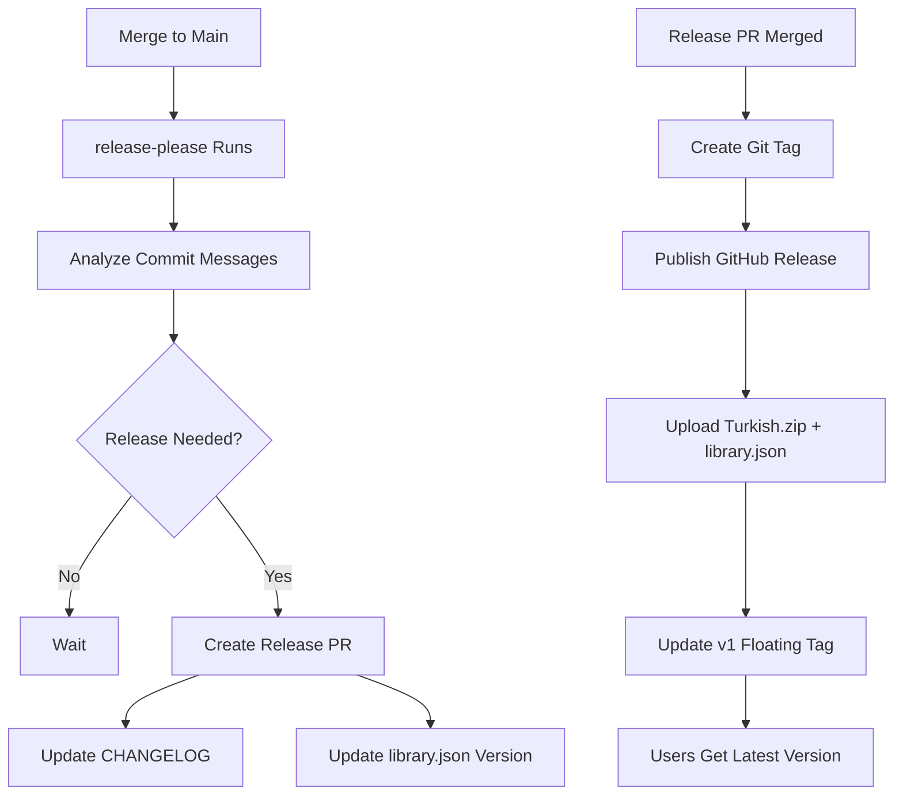
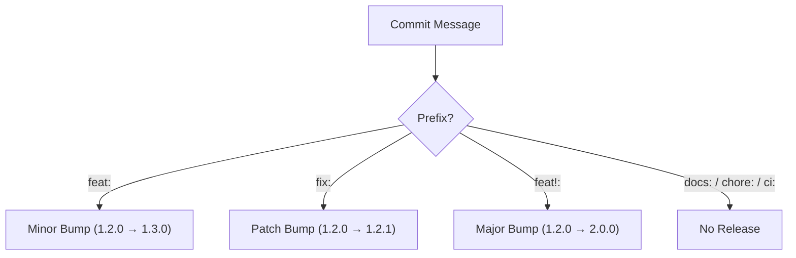
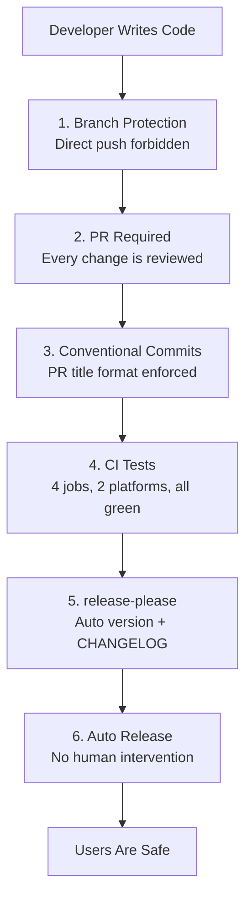

# Developer Workflow

This document describes how to contribute to the project. All changes go through PRs, all tests must pass, and the release process is fully automated.

## Overview



**No changes can be pushed directly to main.** Everything goes through pull requests.

---

## PR Lifecycle



---

## CI Pipeline

Every PR triggers 4 test jobs:



---

## Release Pipeline



---

## Version Determination

Automatically determined from commit messages:



### Conventional Commits (Required)

| Prefix | Meaning | Release Effect |
|--------|---------|----------------|
| `feat:` | New feature | Minor version |
| `fix:` | Bug fix | Patch version |
| `docs:` | Documentation | No release |
| `chore:` | Maintenance | No release |
| `refactor:` | Code improvement | No release |
| `test:` | Test changes | No release |
| `ci:` | CI/CD changes | No release |
| `feat!:` | Breaking change | Major version |

### Prefix Selection Rule (CRITICAL)

> **Adding data to an existing rule (words, terms, swap entries) is NOT a new feature.**

This distinction directly affects version numbers. Wrong prefix = unnecessary version bump.

| Change | Correct prefix | Why |
|---|---|---|
| New `.yml` rule file | `feat:` | New mechanism added |
| New mechanism / feature | `feat:` | Project scope expands |
| Adding words/terms to existing rule | `fix:` | Data added to existing mechanism |
| Adding terms to accept.txt | `fix:` | Existing dictionary expanded |
| Fixing false positives | `fix:` | Bug fix |
| Rule removal / rename | `feat!:` | Breaking change |

---

## Safety Layers

6 layers of protection ensure users never see a broken release:



---

## Quick Reference

```bash
# 1. Fork and clone
git clone https://github.com/YOUR_USERNAME/Turkce-yazim-denetimi.git
cd Turkce-yazim-denetimi

# 2. Create branch
git checkout -b feat/new-feature

# 3. Develop and test
vale --config=.vale.ini fixtures/clean.md   # 0 errors
vale --config=.vale.ini fixtures/dirty.md   # errors must be found

# 4. Commit (conventional format)
git commit -m "feat: add new rule"

# 5. Push and open PR
git push origin feat/new-feature
# Create PR on GitHub
```
