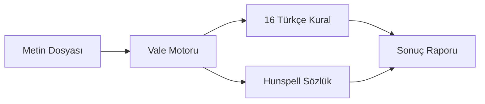

# Teknik Mimari

## Genel Bakış

Türkçe Yazım Denetimi, altyapısında [Vale](https://vale.sh) prose linter motorunu kullanır. Vale, metin dosyalarını YAML tabanlı kurallara göre denetleyen açık kaynaklı bir araçtır. Üzerine 16 Türkçe kural dosyası ve 36 MB'lık Hunspell sözlüğü eklenmiştir.

## Bileşenler

## Entegrasyon Katmanları

| Katman | Dosya | Görev |
|--------|-------|-------|
| Pre-commit | `hooks/Turkce-yazim-denetimi.sh` | Vale'i indir + çalıştır |
| GitHub Actions | `action.yml` | Composite action, raporlama |
| GitLab CI | `.gitlab/Turkce-yazim-denetimi.yml` | Remote include şablonu |
| Raporlama | `scripts/vale-report.sh` | Step Summary + Annotations |
| JUnit | `scripts/vale-to-junit.sh` | GitLab Tests sekmesi |
| CodeClimate | `scripts/vale-to-codeclimate.sh` | GitLab Code Quality |

## Kural Tipleri

Vale'nin desteklediği kural tipleri:

| Tip | Açıklama | Örnek Kural |
|-----|----------|-------------|
| `substitution` | Kelime değiştirme | BitisikYazim, Plaza |
| `existence` | Varlık kontrolü | Buyukharf, Noktalama |
| `capitalization` | Büyük harf kontrolü | CumleBasi |
| `spelling` | Sözlük denetimi | Spelling |
| `repetition` | Tekrar kontrolü | Tekrar |

## Hunspell Sözlük

- `tr.dic` — 34 MB kelime listesi
- `tr.aff` — 2.2 MB ek kuralları
- Fiil çekimleri için regex filtreleri (`Spelling.yml` içinde)
- Özel kelimeler: `styles/config/vocabularies/Turkish/accept.txt`
