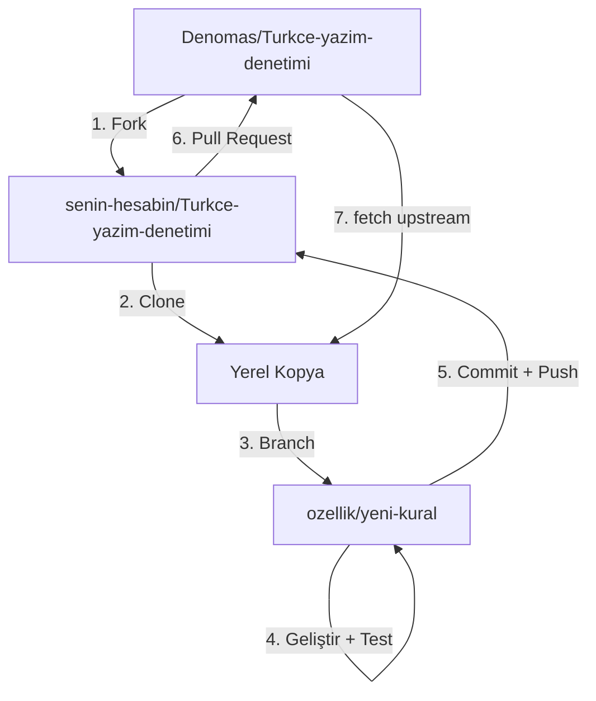

# Fork İş Akışı

Bu proje fork tabanlı katkı modelini kullanır. Aşağıdaki adımları izleyerek projeye destek olabilirsiniz.

## İş Akışı Diyagramı



## Adım Adım

### 1. Fork (Çatallama)

GitHub'da [Denomas/Turkce-yazim-denetimi](https://github.com/Denomas/Turkce-yazim-denetimi) sayfasına gidin ve sağ üstteki **Fork** düğmesine tıklayın.

### 2. Clone (İndirme)

```bash
git clone https://github.com/KULLANICI_ADINIZ/Turkce-yazim-denetimi.git
cd Turkce-yazim-denetimi
```

### 3. Upstream Ekleme

```bash
git remote add upstream https://github.com/Denomas/Turkce-yazim-denetimi.git
git remote -v
# origin    https://github.com/KULLANICI_ADINIZ/Turkce-yazim-denetimi.git
# upstream  https://github.com/Denomas/Turkce-yazim-denetimi.git
```

### 4. Dal Oluşturma

```bash
git checkout -b ozellik/yeni-kural
```

### 5. Geliştirme ve Test

Değişikliklerinizi yapın, ardından zorunlu test döngüsünü çalıştırın:

```bash
# Temiz dosya: 0 hata olmalı
vale --config=.vale.ini fixtures/clean.md

# Hatalı dosya: hatalar bulunmalı
vale --config=.vale.ini fixtures/dirty.md
```

!!! warning "Zorunlu Kural"
    Asla test etmeden kod göndermeyin. Her seferinde hem `clean.md` hem `dirty.md` ile test edin.

### 6. Commit ve Push

```bash
git add .
git commit -m "feat: yeni kural eklendi"
git push origin ozellik/yeni-kural
```

### 7. Pull Request Açma

GitHub'da fork'unuza gidin, **"Compare & pull request"** düğmesine tıklayın. PR şablonunu doldurun.

### 8. Güncel Kalma

```bash
git fetch upstream
git checkout main
git merge upstream/main
git push origin main
```

## Altın Kurallar

1. **Ekleyerek zenginleştiriyoruz** — Hatalı olanı düzeltmek dışında silmiyoruz
2. **Tam Türkçe** — Dosya isimleri, açıklamalar, commit mesajları Türkçe
3. **Test zorunlu** — Testlerden geçmeyen hiçbir şey birleştirilemez
