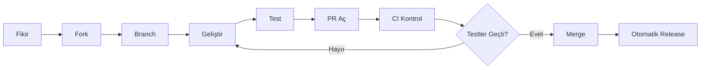
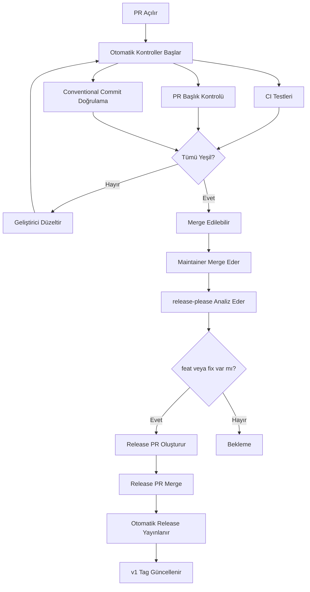
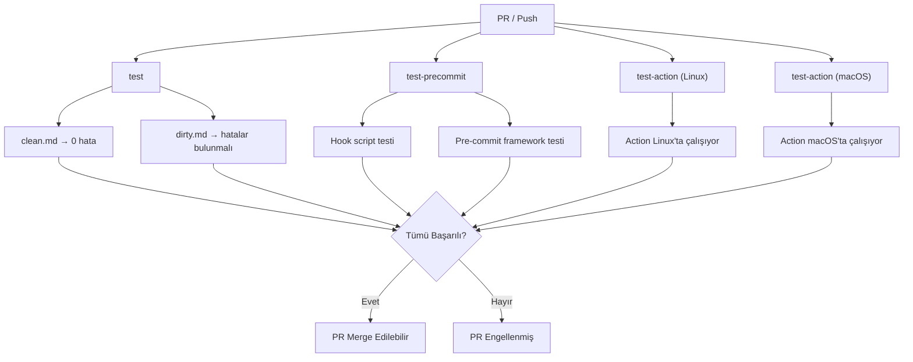
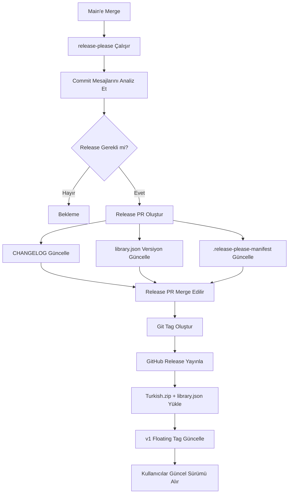
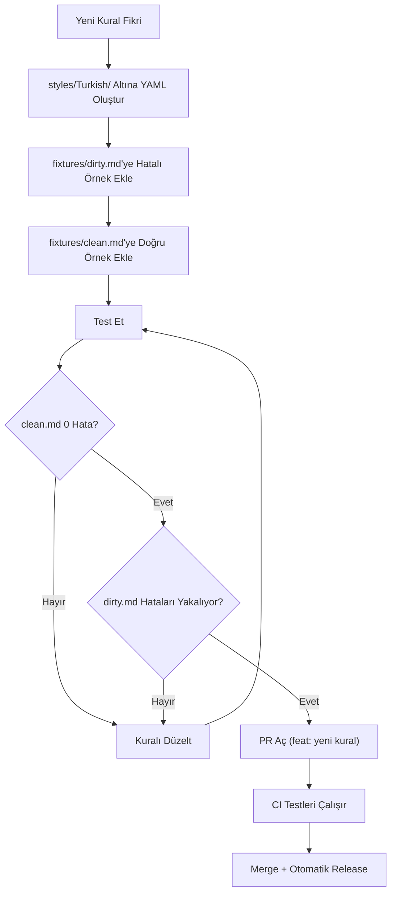
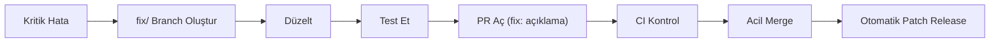
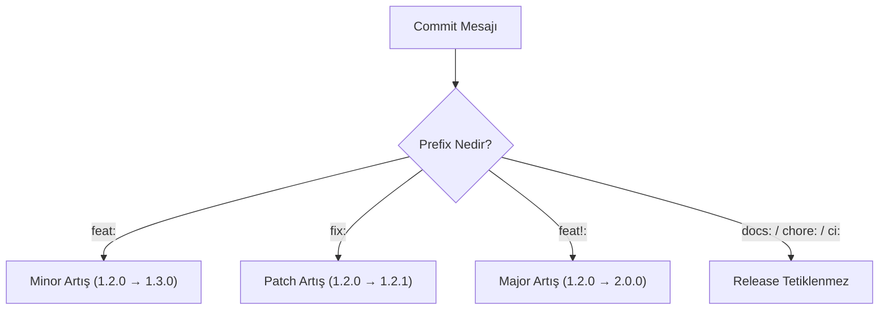
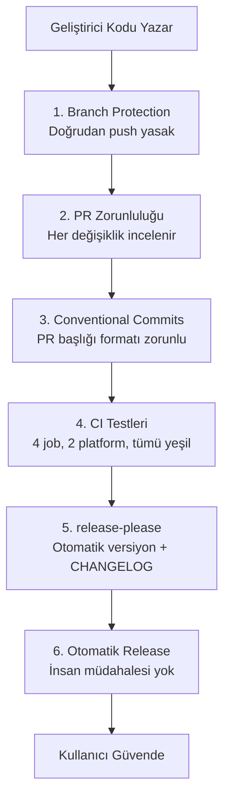

# Geliştirici İş Akışı

Bu belge, projeye nasıl katkıda bulunulacağını adım adım anlatır. Tüm değişiklikler PR ile yapılır, tüm testlerden geçmesi zorunludur ve release süreci tamamen otomatiktir.

## Genel Bakış



**Hiçbir değişiklik doğrudan main branch'e push edilemez.** Her şey PR üzerinden geçer.

---

## PR Yaşam Döngüsü



---

## CI Pipeline Detayı

Her PR açıldığında 4 ayrı test çalışır:



---

## Release Pipeline



---

## Yeni Kural Ekleme Akışı



---

## Hotfix Akışı

Kritik bir hata bulunduğunda:



`fix:` prefix'i otomatik olarak patch versiyon artışına neden olur (1.2.0 → 1.2.1).

---

## Versiyon Belirleme

Commit mesajlarına göre otomatik belirlenir:



### Conventional Commits Zorunluluğu

Her PR başlığı şu prefix'lerden biriyle başlamalıdır:

| Prefix | Anlam | Release Etkisi |
|--------|-------|----------------|
| `feat:` | Yeni özellik | Minor versiyon |
| `fix:` | Hata düzeltme | Patch versiyon |
| `docs:` | Dokümantasyon | Release yok |
| `chore:` | Bakım işleri | Release yok |
| `refactor:` | Kod iyileştirme | Release yok |
| `test:` | Test ekleme/düzeltme | Release yok |
| `ci:` | CI/CD değişikliği | Release yok |
| `feat!:` | Kırıcı değişiklik | Major versiyon |

### Prefix Seçim Kuralı (KRİTİK)

> **Mevcut bir kurala veri eklemek (kelime, terim, swap girişi) yeni bir özellik DEĞİLDİR.**

Bu ayrım versiyon numarasını doğrudan etkiler. Yanlış prefix gereksiz versiyon artışına neden olur.

| Değişiklik | Doğru prefix | Neden |
|---|---|---|
| Yeni `.yml` kural dosyası oluşturma | `feat:` | Yeni mekanizma ekleniyor |
| Yeni mekanizma / özellik ekleme | `feat:` | Projenin kapsamı genişliyor |
| Mevcut kurala kelime/terim ekleme | `fix:` | Mevcut mekanizmaya veri ekleniyor |
| accept.txt'ye terim ekleme | `fix:` | Mevcut sözlük genişletiliyor |
| False positive düzeltme | `fix:` | Hata gideriliyor |
| Kural silme / yeniden adlandırma | `feat!:` | Kırıcı değişiklik |

**Örnek:**

```bash
# ✅ DOĞRU: Mevcut kurala kelime eklemek
git commit -m "fix(plaza): Katman 1 teknik terimlerinin Türkçe karşılıkları eklendi"

# ❌ YANLIŞ: Kelime eklemek feat değildir!
git commit -m "feat(plaza): yeni teknik terimler eklendi"

# ✅ DOĞRU: Yeni kural dosyası oluşturmak
git commit -m "feat(rules): Fabrika jargonu kuralı eklendi"
```

---

## Güvenlik Katmanları

Kullanıcıların asla hatalı bir sürüm görmemesi için 6 katmanlı koruma:



---

## Katkıda Bulunan Tipleri

| Tip | İş Akışı | PR Kuralı |
|-----|----------|-----------|
| **Dış geliştirici** | Fork → Branch → PR | Conventional commit zorunlu |
| **Denomas ekibi** | Branch → PR | Conventional commit zorunlu |
| **AI ajan** | Branch → PR | Conventional commit zorunlu, test zorunlu |
| **Dependabot** | Otomatik PR | Patch/minor otomatik merge |

---

## Hızlı Referans

```bash
# 1. Fork ve clone
git clone https://github.com/KULLANICI/Turkce-yazim-denetimi.git
cd Turkce-yazim-denetimi

# 2. Branch oluştur
git checkout -b feat/yeni-ozellik

# 3. Geliştir ve test et
vale --config=.vale.ini fixtures/clean.md   # 0 hata
vale --config=.vale.ini fixtures/dirty.md   # hatalar bulunmalı

# 4. Commit (conventional format)
git commit -m "feat: yeni kural eklendi"

# 5. Push ve PR aç
git push origin feat/yeni-ozellik
# GitHub'da PR oluştur
```
